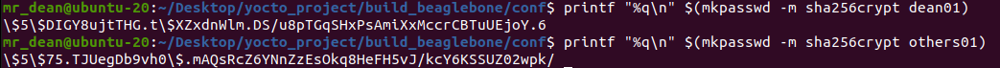

<h3> Adding account details in local.conf </h3>

## 1. Introduce
- Adding and modifying user account in local.conf.
- This includes modifying root user passwd.

## 2. Steps 
- Create an encrypted passwd for root and other users
```shell 
printf "%q\n" $(mkpasswd -m sha256crypt dean01)
printf "%q\n" $(mkpasswd -m sha256crypt others01)
```


- add the below to the local.conf
```shell 
# ADD AND MODIFY USER ACCOUNT
INHERIT += "extrausers"

# set image user password
ROOT_PASSWD = "\$5\$DIGY8ujtTHG.t\$XZxdnWlm.DS/u8pTGqSHxPsAmiXxMccrCBTuUEjoY.6"
OTHERS_PASSWD = "\$5\$75.TJUegDb9vh0\$.mAQsRcZ6YNnZzEsOkq8HeFH5vJ/kcY6KSSUZ02wpk/"

EXTRA_USERS_PARAMS = "\
    usermod -p '${ROOTRASSWD}' root; \
    useradd -p '${OTHERS_PASSWD}' mrdean01; \
    useradd -p '${OTHERS_PASSWD}' mrdean02; \ 
    "

```
- Bake your preferred image
```shell
bitbake core-image-minimal
```