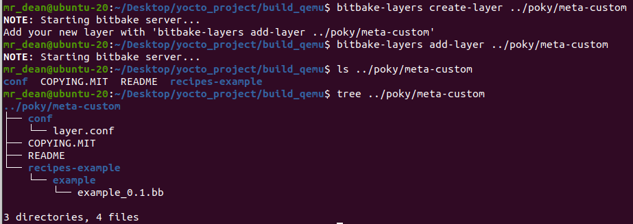

<h3> Creating a layer and image receipe </h3>

## 1. Introduce
- Create a layer called meta-custom
- Create a reciple image called mrdean-core-image-base

## 2. Steps
- Seed into poky
```bash
$ cd poky
$ source oe-init-build-env ../build_beaglebone
```
- Create and add new layer
```bash
$ bitbake-layers create-layer ../poky/meta-custom
$ bitbake-layers add-layer ../poky/meta-custom
```

- You can check if the new layer has been added.
```bash
$ bitbake-layers show-layers
```
- Create an image recipe
```bash 
$ mkdir ../poky/meta-custom/recipe-core && mkdir ../poky/meta-custom/recipe-core/images
$ touch ../poky/meta-custom/recipe-core/images/mrdean-core-image-base.bb
```
- Creating an image from core-image-base
```bash
nano ../poky/meta-custom/recipe-core/images/mrdean-core-image-base.bb
```
- Copy the below and add to the image recipe(mrdean-core-image-base.bb)
```bash
SUMMARY = "Custom image from core-image-base"

LICENSE = "MIT"

require recipes-core/images/core-image-base.bb

IMAGE_FEATURES:remove = "splash"

inherit extrausers

# set image user password
ROOT_PASSWD = "\$5\$DIGY8ujtTHG.t\$XZxdnWlm.DS/u8pTGqSHxPsAmiXxMccrCBTuUEjoY.6"
OTHERS_PASSWD = "\$5\$75.TJUegDb9vh0\$.mAQsRcZ6YNnZzEsOkq8HeFH5vJ/kcY6KSSUZ02wpk/"

EXTRA_USERS_PARAMS = "\
    usermod -p '${ROOT_PASSWD}' root; \
    useradd -p '${OTHERS_PASSWD}' mrdean01; \
    useradd -p '${OTHERS_PASSWD}' mrdean02; \
    "
```
- Create bake new image
```bash
bitbake mrdean-core-image-base
```


