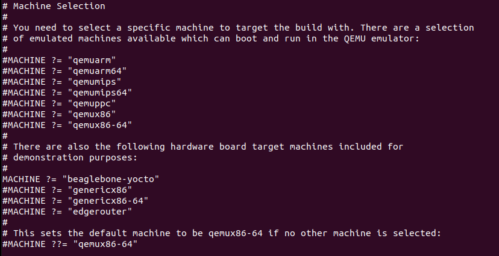

<h1> Yocto Project Using Beaglebone Black <h1>

## 1. Introduction 


## 2. Prepare

| Software                   | Hardware              |
|----------------------------|-----------------------|
| ubuntu 18.04/20.04/22.04   | Beaglebone black      |


## 3. Setup, baking and generating an image
- Download poky repo
```shell
git clone https://git.yoctoproject.org/poky -b kirkstone
```

- Prepare the build environment
```shell
cd poky
source oe-init-build-env ../build_bb
```
- Make the below changes in the local.conf


- Bake your preferred image
```shell
bitbake core-image-minimal
```