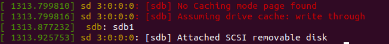
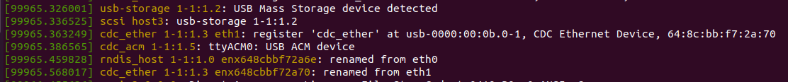

<h1> Yocto Project Using Beaglebone Black <h1>

## 1. Introduction 


## 2. Prepare

| Software                   | Hardware              |
|----------------------------|-----------------------|
| ubuntu 18.04/20.04/22.04   | Beaglebone black      |


## 3. Setup, baking, generating and flashing an image
- Download poky repo
```shell
$ git clone https://git.yoctoproject.org/poky -b kirkstone
```

- Prepare the build environment
```shell
$ cd poky
$ source oe-init-build-env ../build_bb
```
- Make the below changes in the local.conf


- Bake your preferred image
```shell
$ bitbake core-image-minimal
```
- The images are available in `tmp/deploy/images/beaglebone-yocto`.
```shell
$ cd tmp/deploy/images/beaglebone-yocto
```
- Fix and format your sd card.

- Check sd card with the command below.
```shell
$ dmesg
```


- Data duplicate/copy images to the sd card
```shell
$ sudo dd if=core-image-minimal-beaglebone-yocto.wic of=/dev/sdb
```
- Plug the sd card and fix it to your beaglebone. Connect the txd, rxd, gnd of your beaglebone to a uart-usb adapter connected to your machine.

- After connecting serial and beaglebone black to pc, using the dmesg to identify the new port
```shell
$ dmesg
```


- Use the command to access the beaglebone black
```shell
$ sudo picocom -b 115200 /dev/ttyACM0
```
- By default beaglebone black boots from its internal eMMC storage, to boot a new image from the sdcard, press and hold the reset button while you power your board. 